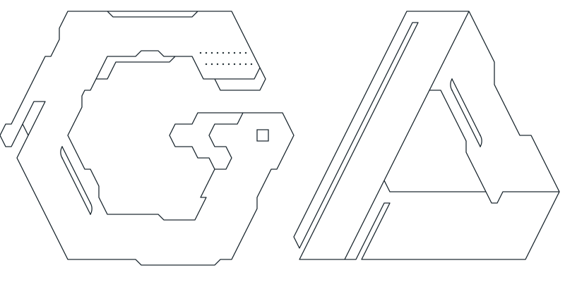

<picture>
  <source media="(prefers-color-scheme: dark)" srcset="assets/img/logo-dark.svg">
  
</picture>

## Hello

I'm Gustavo Alvarado, an Ecuadorian mechatronics engineer (ESPOL). I build software for unmanned aircraft: operator apps, real-time computer vision and embedded Linux.

Currently R&D engineer, drone specialist and software developer at [Robiotec](https://robiotec.ec/).

- 🎥 Built solo the operator app for a military-use surveillance camera: video latency from about 2.5 s to about 1.2 s over a satellite link.
- 🛩️ 20+ fixed-wing VTOL flights in 2026 at sites above 3,200 m ASL, most as pilot in command.
- 👁️ Took a YOLOv8 detection system to production on NVIDIA Jetson with TensorRT.
- 📡 Enabled a 93 km unsupervised point-to-point VTOL mission.

## Technologies

| Languages | Embedded & UAS | Vision & AI | Apps & tools |
|:-:|:-:|:-:|:-:|
|      |      |     |     |

## Contact

  
